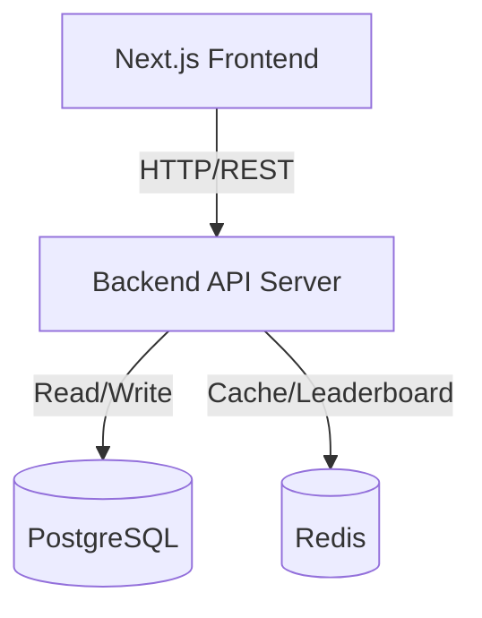

# Low-Level Design - BrainBolt Adaptive Quiz Platform

## 1. System Architecture



### 1.1 Technology Stack
- **Frontend**: Next.js 16, React, TypeScript, TailwindCSS
- **Backend**: Node.js, Express, TypeScript
- **Database**: PostgreSQL with Prisma ORM
- **Cache**: Redis
- **Infrastructure**: Docker, docker-compose

---

## 2. Module Responsibilities

### 2.1 Backend Modules

#### `src/services/engine.ts`
**Responsibility**: Core quiz logic
- `getNextQuestion(userId)`: Retrieve appropriate question based on difficulty
- `processAnswer(userId, questionId, answer, idempotencyKey)`: Validate answer, update state, calculate score
- `getUserMetrics(userId)`: Get user statistics

#### `src/services/questionPool.ts`
**Responsibility**: Question caching and retrieval
- `populateQuestionPool(difficulty)`: Load questions into Redis
- `getQuestionFromPool(difficulty, excludeIds)`: Get random unanswered question
- `initializeAllQuestionPools()`: Startup initialization

#### `src/services/streakDecay.ts`
**Responsibility**: Streak decay management
- `checkAndApplyStreakDecay(userId)`: Check inactivity and apply decay

#### `src/algorithms/adaptive.ts`
**Responsibility**: Adaptive difficulty algorithm
- `compute_streak(history)`: Calculate current streak
- `compute_momentum(history, window)`: Measure recent performance trend
- `next_difficulty(currentDiff, history)`: Determine next difficulty level
- `calculate_score(difficulty, streak)`: Score calculation formula

#### `src/middleware/rateLimiter.ts`
**Responsibility**: API rate limiting
- `createRateLimiter(config)`: Factory for rate limiters
- `rateLimiters.*`: Preset limits for different endpoints

#### `src/routes/*`
**Responsibility**: HTTP routing and request handling
- `quiz.ts`: Question and answer endpoints
- `leaderboard.ts`: Leaderboard queries
- `metrics.ts`: User statistics

---

## 3. API Schemas

### 3.1 GET `/v1/quiz/next`

**Request Headers**:
```typescript
{
  'x-user-id': string  // Required
}
```

**Response** (200):
```json
{
  "questionId": "q15",
  "difficulty": 3,
  "prompt": "What is the capital of France?",
  "choices": ["London", "Berlin", "Paris", "Madrid"],
  "currentDifficulty": 3,
  "currentScore": 125,
  "currentStreak": 5,
  "maxStreak": 8
}
```

### 3.2 POST `/v1/quiz/answer`

**Request Body**:
```json
{
  "questionId": "q15",
  "answer": "Paris",
  "answerIdempotencyKey": "unique-key-12345"
}
```

**Response** (200):
```json
{
  "correct": true,
  "newDifficulty": 4,
  "newStreak": 6,
  "maxStreak": 8,
  "newScore": 150,
  "scoreDelta": 25,
  "totalScore": 150,
  "stateVersion": 42,
  "leaderboardRankScore": 15,
  "leaderboardRankStreak": 8
}
```

### 3.3 GET `/v1/quiz/metrics`

**Response**:
```json
{
  "currentDifficulty": 4,
  "streak": 6,
  "maxStreak": 8,
  "totalScore": 150,
  "accuracy": 78.5,
  "totalQuestions": 42,
  "correctQuestions": 33,
  "wrongQuestions": 9,
  "recentPerformance": [...]
}
```

---

## 4. Database Schema

### 4.1 Tables

#### `questions`
```sql
CREATE TABLE questions (
  id            TEXT PRIMARY KEY,
  difficulty    INTEGER NOT NULL,
  prompt        TEXT NOT NULL,
  choices       JSONB NOT NULL,
  correct       TEXT NOT NULL,
  tags          TEXT[]
);

CREATE INDEX idx_questions_difficulty ON questions(difficulty);
```

#### `user_state`
```sql
CREATE TABLE user_state (
  userId            TEXT PRIMARY KEY,
  currentDifficulty INTEGER DEFAULT 1,
  streak            INTEGER DEFAULT 0,
  maxStreak         INTEGER DEFAULT 0,
  totalScore        INTEGER DEFAULT 0,
  lastQuestionId    TEXT,
  lastAnswerAt      TIMESTAMP,
  stateVersion      INTEGER DEFAULT 0
);

CREATE INDEX idx_user_state_lastAnswerAt ON user_state(lastAnswerAt);
```

#### `answer_log`
```sql
CREATE TABLE answer_log (
  id             TEXT PRIMARY KEY,
  userId         TEXT NOT NULL,
  questionId     TEXT NOT NULL,
  selectedAnswer TEXT NOT NULL,
  isCorrect      BOOLEAN NOT NULL,
  scoreDelta     INTEGER NOT NULL,
  answeredAt     TIMESTAMP DEFAULT NOW()
);

CREATE INDEX idx_answer_log_userId ON answer_log(userId);
CREATE INDEX idx_answer_log_userId_answeredAt ON answer_log(userId, answeredAt DESC);
```

---

## 5. Cache Strategy

### 5.1 Redis Keys

| Key Pattern | Type | Purpose | TTL |
|------------|------|---------|-----|
| `user:state:{userId}` | String | User state cache | 60s |
| `questions:pool:{difficulty}` | SET | Question IDs | 1h |
| `leaderboard:score` | Sorted Set | Score leaderboard | Persistent |
| `leaderboard:streak` | Sorted Set | Streak leaderboard | Persistent |
| `ratelimit:{userId}:{path}` | Sorted Set | Rate limiting | Window |

### 5.2 Invalidation Strategy
- **User State**: Write-through, 60s TTL
- **Question Pools**: Lazy load, 1h TTL
- **Leaderboards**: Real-time updates, no TTL

---

## 6. Adaptive Algorithm Pseudocode

### 6.1 Next Difficulty
```python
function next_difficulty(current_diff, history):
    momentum = compute_momentum(history, window=3)
    streak = compute_streak(history)
    
    if momentum >= 2 and streak >= 2 and current_diff < MAX_DIFF:
        return current_diff + 1
    
    if momentum <= -2 and current_diff > MIN_DIFF:
        return current_diff - 1
    
    return current_diff
```

### 6.2 Score Calculation
```python
function calculate_score(difficulty, streak):
    base = difficulty * 10
    # Multiplier: 1.0 + (streak * 0.2), capped at streak 5 (max 2.0x)
    streak_factor = 1.0 + min(streak, 5) * 0.2
    return round(base * streak_factor)
```

---

## 7. Rate Limiting

### 7.1 Limits
- Answer Submission: **30/minute**
- Question Fetch: **100/minute**
- General: **200/minute**

### 7.2 Algorithm
Sliding window using Redis Sorted Sets

---

## 8. Streak Decay

### 8.1 Configuration
- Threshold: **24 hours** inactivity
- Decay Rate: **50%** reduction
- Minimum Streak: **3** (only decay if ≥ 3)

### 8.2 Trigger
Applied automatically when user accesses system via `getUserState()`

---

## 9. Edge Cases

### 9.1 Ping-Pong Prevention
**Problem**: User alternates between correct/wrong to stay at comfortable difficulty

**Solution**: Momentum calculation requires **sustained performance** (66% over 3 questions) to increase difficulty. Single correct answer doesn't trigger increase.

### 9.2 Streak Reset
**Boundary**: Streak resets to 0 immediately on wrong answer, no grace period.

### 9.3 No Available Questions
**Fallback Chain**:
1. Try unanswered questions at target difficulty
2. Allow repeated questions at target difficulty
3. Return any question from database

### 9.4 Concurrent Requests
**Protection**: Idempotency keys prevent duplicate processing

---

## 10. Performance

### 10.1 Optimizations
- Redis caching reduces DB load ~80%
- Question pools enable O(1) random selection
- Indexed queries for user state and history
- Connection pooling via Prisma

### 10.2 Scalability
- Stateless backend (horizontal scaling)
- Redis single instance sufficient for MVP
- Can partition answer_log if needed

